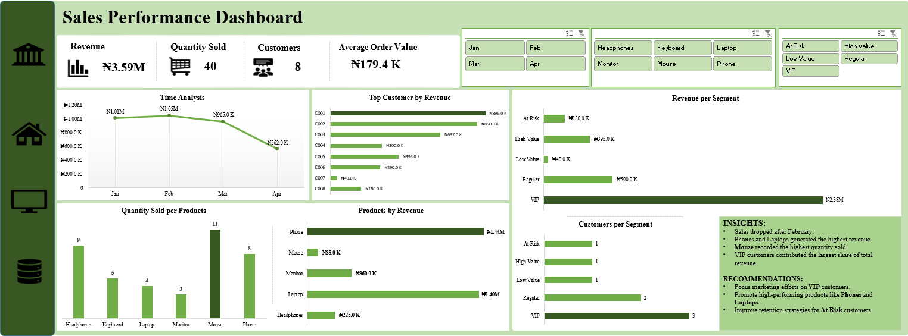

# Sales Performance Dashboard

## Overview
This project presents an interactive Sales Performance Dashboard built in Microsoft Excel to analyze sales trends, customer behavior, product performance, and customer segmentation.

The dashboard provides insights into:
- Revenue performance over time
- Customer purchasing behavior
- Product contribution to revenue
- Customer segmentation analysis
- Quantity sold analysis

---

## Objectives
The goal of this project is to:
- Monitor key sales KPIs
- Identify top-performing products
- Analyze customer revenue contribution
- Segment customers based on purchase frequency and spending behavior
- Support business decision-making with data-driven insights

---

## Tools Used
- Microsoft Excel
- Pivot Tables
- Pivot Charts
- Slicers
- Lookup Functions (VLOOKUP / INDEX-MATCH)
- Conditional Formatting

---

## Key Metrics
- Total Revenue
- Quantity Sold
- Total Customers
- Average Order Value (AOV)

---

## Dashboard Features
### Sales Trend Analysis
Tracks monthly revenue performance to identify growth and decline patterns.

### Product Performance Analysis
Analyzes:
- Quantity sold per product
- Revenue contribution by product

### Customer Analysis
Highlights top customers based on revenue contribution.

### Customer Segmentation
Customers were segmented using:
- Frequency Score
- Monetary Score

Segments include:
- VIP
- High Value
- Regular
- At Risk
- Low Value

### Interactive Filters
The dashboard includes slicers for:
- Month
- Product
- Customer Segment

---

## Key Insights
- Sales declined after February, indicating a reduction in overall performance.
- Phones and Laptops generated the highest revenue.
- Mouse recorded the highest quantity sold.
- VIP customers contributed the largest share of total revenue.

---

## Recommendations
- Focus marketing efforts on VIP customers to improve retention.
- Promote high-performing products such as Phones and Laptops.
- Develop retention strategies for At Risk customers.
- Increase engagement campaigns for Low Value customers.

---

## Project Files
- Excel Dashboard File
- Dataset

## 📸 Dashboard Preview

